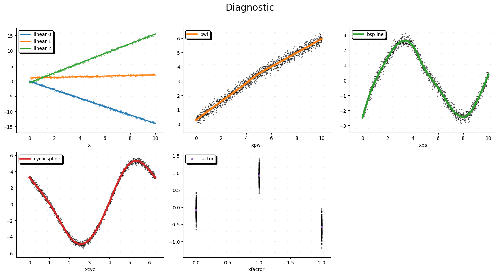

# LPSpline

LPSpline is a Python package for building and optimizing linear spline models using an intuitive additive API. It provides a flexible way to model non-linear relationships using various spline types like Piecewise Linear, B-Splines, Cyclic Splines, and Categorical Factors.

## Installation

Install `lpspline` via pip directly from the repository, or if published:

```bash
pip install lpspline
```
*(Note: If not yet on PyPI, install via `pip install .` in the project root)*

## Quick Start

LPSpline allows you to easily compose additive models. Here's a quick example:

```python
import numpy as np
import polars as pl
from lpspline import LinearSpline, PiecewiseLinear, BSpline

# 1. Prepare Data
# Suppose df is a Polars DataFrame with columns "x1", "x2", "x3", and "target"
df = pl.DataFrame({
    "x1": np.linspace(0, 10, 100),
    "x2": np.random.rand(100) * 10,
    "x3": np.linspace(0, 20, 100),
    "target": np.sin(np.linspace(0, 10, 100)) + np.random.normal(0, 0.1, 100)
})

# 2. Define Components
model = (
    LinearSpline("x1", bias=True) +
    PiecewiseLinear("x2", knots=[5.0]) +
    BSpline("x3", knots=np.linspace(0, 20, 5), degree=3)
)

# 3. Fit the Model
model.fit(df, df["target"])

# 4. Predict
predictions = model.predict(df)
```

## Expected output

Once the model is fitted, you will see a detailed summary to the console:

```
==================================================
✨ Model Summary ✨
==================================================
Problem Status: optimal
--------------------------------------------------
Spline Type       | Term            | Params    
--------------------------------------------------
🟢 Linear         | x1              | 2         
🟢 Piecewise      | x2              | 2         
🟢 BSpline        | x3              | 5         
--------------------------------------------------
📊 Total Parameters                 | 9         
==================================================
```

## Demo with multiple variables

Inside the `notebook/` folder you will find a `demo.ipynb` file which plots the learned spline components automatically:


