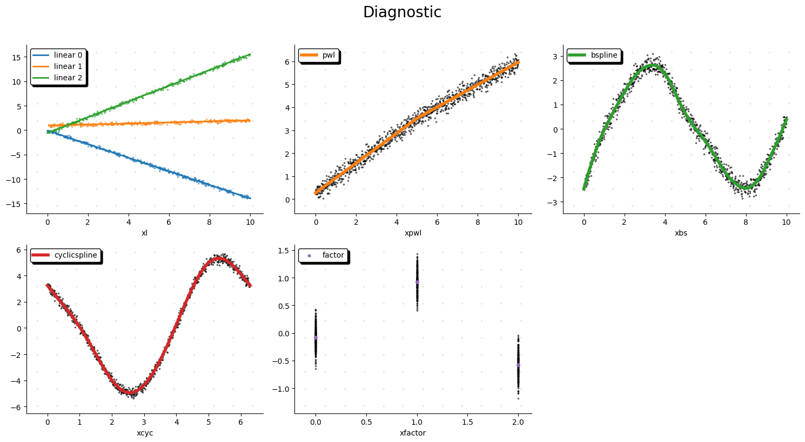

# LPSpline

LPSpline is a Python package for building and optimizing linear spline models using an intuitive additive API. It provides a flexible way to model non-linear relationships using various spline types like Piecewise Linear, B-Splines, Cyclic Splines, and Categorical Factors.

## Installation

Install `lpspline` via pip directly from the repository, or if published:

```bash
pip install lpspline
```


## Main Features

- Additive model definition
- CVXPY backend for optimization
- Multiple spline types: Linear, Piecewise Linear, B-Splines, Cyclic Splines, Categorical Factors, Constant
- Penalties on the splines: Ridge, Lasso
- Constraints on the splines: Monotonic, Convex, Concave, Anchor
- Polars DataFrame integration
- Nice plots using `matplotlib` and `pimpmyplot`

## Sandbox

Visit the [marimo playground](https://molab.marimo.io/notebooks/nb_MWvkutFSuuXinahopPY1NA) for a live demo

## Quick Start

Here a small code example:

```python
import numpy as np
import polars as pl
from lpspline import l, pwl, bs, cs
from lpspline.viz import plot_diagnostic
from lpspline.datasets import load_demo_dataset


# ---------------------------------------- Data Generation
X, y = load_demo_dataset(samples = 1000)

# ---------------------------------------- Model Definition
model = (
    +l(term='xl')
    + pwl(term='xpwl', knots=3)
    + bs(term="xbs", knots=10, degree=2)
    + cs(term="xcyc", order=3)
    + f(term="xfactor")
)
# ---------------------------------------- Model Fitting
model.fit(X, y)

# ---------------------------------------- Model Prediction
predictions = model.predict(X)

# ---------------------------------------- Model Visualization
plot_diagnostic(model=model, X=X, y=y, ncols=3)
```

## Expected output

Once the model is fitted, you will see a detailed summary to the console and a diagnostic plot showing the fitted splines.

```
========================================================================================================================
✨ Model Summary ✨
========================================================================================================================
Problem Status: ✅ optimal
------------------------------------------------------------------------------------------------------------------------
Spline Type          | Term         | Tag             | Constraints          | Penalties            | Params 
------------------------------------------------------------------------------------------------------------------------
🟢 Linear            | xl           | linear          | None                 | None                 | 2       
🟢 PiecewiseLinear   | xpwl         | pwl             | None                 | None                 | 5       
🟢 BSpline           | xbs          | bspline         | None                 | None                 | 11      
🟢 CyclicSpline      | xcyc         | cyclicspline    | None                 | None                 | 7       
🟢 Factor            | xfactor      | factor          | None                 | None                 | 5       
------------------------------------------------------------------------------------------------------------------------
📊 Total Parameters                                                                                 | 29
========================================================================================================================

Model fitted successfully.
```



