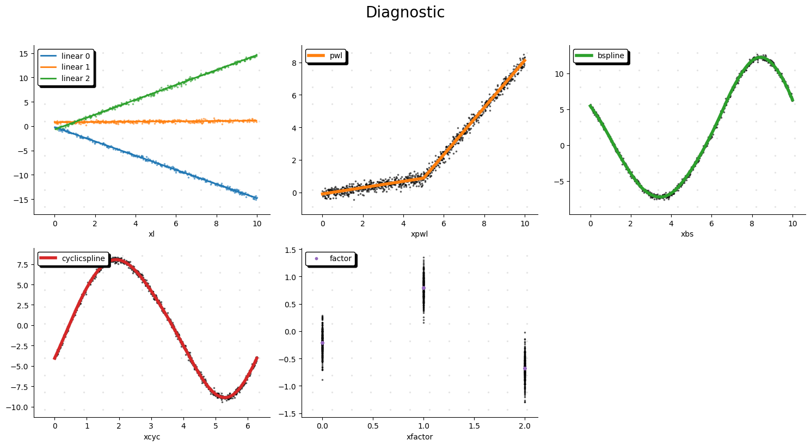
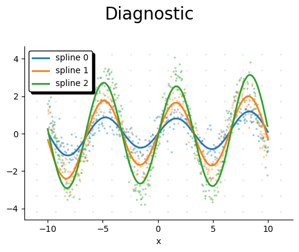
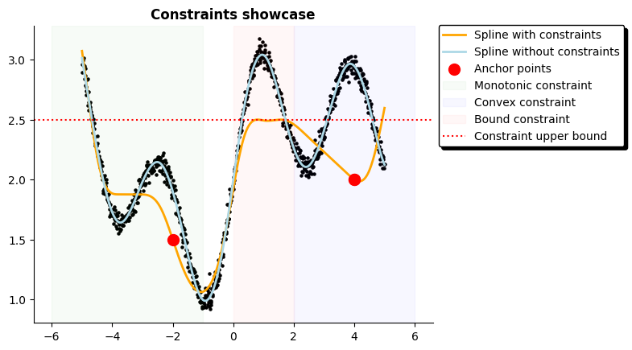

:html_theme.sidebar_primary.remove:

Demo
====

Standard regression
------------------------

.. code-block:: python

    from lpspline import l, pwl, bs, cs, f
    from lpspline.viz import plot_diagnostic
    from lpspline.datasets import load_demo_dataset

    X, y = load_demo_dataset(samples=1000)

    model = (
        +l(term='xl', by='xfactor')
        + pwl(term='xpwl', knots=3)
        + bs(term="xbs", knots=10, degree=2)
        + cs(term="xcyc", order=3)
        + f(term="xfactor")
    )

    model.fit(X, y)
    plot_diagnostic(model=model, X=X, y=y, ncols=3)

by splines
------------

.. code-block:: python

    from lpspline import bs, l, pwl, cs
    from lpspline.datasets import load_by_dataset
    from lpspline.viz import plot_diagnostic

    X, y = load_by_dataset(samples=1000, type='cyclic')

    model = (
        + cs(term='x', tag='spline', order=3, by='by')

        ## Try using these splines instead 
        #+ l(term='x', tag='spline', by='by')
        #+ pwl(term='x', tag='spline', by='by', knots=10)
        #+ bs(term='x', tag='spline', by='by', knots=10)
    )
    
    model.fit(X, y)
    plot_diagnostic(model=model, X=X, y=y, ncols=3)

Constraints
-------------

.. code-block:: python

    import numpy as np
    import polars as pl
    import matplotlib.pyplot as plt
    import pimpmyplot as pmp

    from lpspline import bs
    from lpspline.constraints import Monotonic, Convex, Anchor, Concave

    # -------------------------- Create demo dataset with wiggly target
    np.random.seed(50)
    N = 1000
    x = np.linspace(-5, 5, N)
    by = np.random.randint(0, 3, N)
    y = (np.tanh(x)+1) + np.exp(-x/5) + np.sin(2*x)/2 +  np.random.randn(N)*0.05
    df = pl.DataFrame({"x": x, 'by': by,"y": y})

    # -------------------------- Model with constraints
    anchor_points = [(-2, 1.5), (4, 2)]
model = (
    # Try changing the spline using pwl or cs
    +bs("x", knots=np.linspace(-10, 10, 30), degree=3, tag='bs')
        .add_constraint(
            # and fun here playing with constraint
            Convex(start=2, end = 10),
            Monotonic(decreasing=True, start=-10, end = -1),
            Anchor(*anchor_points),
            Bound(lower=None, upper=2.5, n=10, start=0, end=2)
        )
)

    # -------------------------- Model without constraints for comparison
    model_nocs = (
        +bs("x", knots=np.linspace(-10, 10, 30), degree=3, tag='bs')
    )

    model.fit(X=df, y=df['y'])
    model_nocs.fit(X=df, y=df['y'])

    # -------------------------- Cute plot to visualize result
    plt.scatter(df['x'], df['y'], color='k', s=5)
    plt.plot(df['x'], model.predict(df), color='orange', linewidth=2, label='Spline with constraints')
    plt.plot(df['x'], model_nocs.predict(df), color='lightblue', linewidth=2, label='Spline without constraints')
    for p in anchor_points:
        plt.scatter(*p, color='r', s=100, zorder=100)
    plt.scatter(*p, color='r', s=100, zorder=100, label='Anchor points')

    plt.axvspan(xmin=-6, xmax=-1, color='green', alpha=.03, label='Monotonic constraint')
    plt.axvspan(xmin=2, xmax=6, color='blue', alpha=.03, label='Convex constraint')
    pmp.legend(loc='ext side upper right')
    pmp.remove_axis('top', 'right')
    plt.title('Constraints showcase', fontweight='bold')

