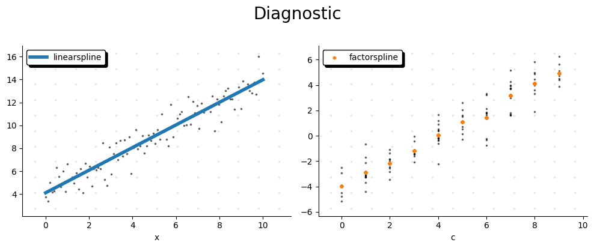

Quickstart
==========

Installation
------------

Install ``lpspline`` via pip directly from the command line:

.. code-block:: bash

   pip install lpspline

Basic Usage
-----------

LPSpline optimizes shape-constrained additive configurations utilizing convex methods (via CVXPY). 
It generates regression equations binding B-Splines, Linear blocks, or Categorical matrices smoothly.

For each spline type there is a dedicated class you can import

.. code-block:: python

   from lpspline import c, f, l, pwl, bs, cs

* ``c``: constant
* ``f``: factor
* ``l``: linear
* ``pwl``: piecewise linear
* ``bs``: B-spline
* ``cs``: cyclic spline

LpRegressor
-----------

The class ``LpRegressor`` is a sklearn-like interface to perform a regression with your data.

The easiest way to initialize an instance is to simply write down the formula.

.. code-block:: python

   from lpspline import c, f

   mymodel = (
      l(term='x')
      + f(term='c')
   )

`term` is the name of the column in the DataFrame X the spline is fitted on.

.. tip::

   If your model consist in just one spline you can initialize the instance like so:

   .. code-block:: python

      mymodel = +l(term='x')

You can still initialize the ``LpRegressor`` creating an instance in the classical way:

.. code-block:: python

   mymodel = LpRegressor(splines=[l(term='x'), f(term='c')])

Fit and predict   
----------------

``LpRegressor`` is compatible with sklearn syntax. It works with ``polars`` DataFrames and Series.

.. code-block:: python

   import polars as pl
   import numpy as np
   from lpspline import c, f

   X = pl.DataFrame({
      'x': np.linspace(0, 10, 100),
      'c': np.random.randint(0, 10, 100)
   })
   y = pl.Series(X['x'] + X['c'] + np.random.randn(100))

   mymodel = l(term='x') + f(term='c')
   mymodel.fit(X, y)
   y_pred = mymodel.predict(X)

Summary
-------

When you fit the model a summary is printed to the console with all main informations:

* spline type
* term
* applied constraints
* applied penalties
* number of parameters

.. code-block:: text

   ========================================================================================================================
   ✨ Model Summary ✨
   ========================================================================================================================
   Problem Status: ✅ optimal
   ------------------------------------------------------------------------------------------------------------------------
   Spline Type          | Term         | Tag             | Constraints          | Penalties            | Params  
   ------------------------------------------------------------------------------------------------------------------------
   🟢 Linear            | x            | linearspline    | None                 | None                 | 2       
   🟢 Factor            | c            | factorspline    | None                 | None                 | 10      
   ------------------------------------------------------------------------------------------------------------------------
   📊 Total Parameters                                                                                 | 12
   ========================================================================================================================

Diagnostics
-----------

``plot_diagnostic`` is a function that shows the diagnostic of the model.

It shows each fitted spline separately.

If you pass target to argument ``y: pl.Series`` it will be shown residuals relative to each spline as well.

In practice for each spline :math:`s_i` it will be shown:

.. math::

   r_i = y - \sum_{j \neq i} s_j(X)

.. code-block:: python

   from lpspline import plot_diagnostic

   plot_diagnostic(model=mymodel, X=X, y=y)

