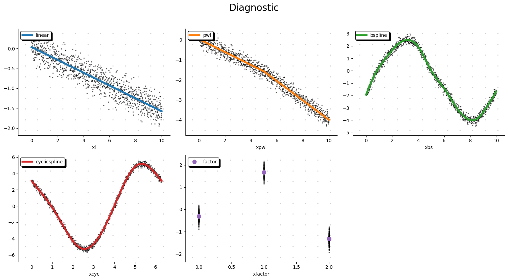

User Guide
==========

``lpspline`` is designed to be an intuitive way to frame optimization problems involving splines using an additive syntax. Under the hood, it constructs a complex CVXPY problem allowing for flexible configurations of shapes, penalties, and constraints.

Additive Model Definition
-------------------------

The core concept relies on summing individual spline components together. 

.. code-block:: python

   from lpspline import l, pwl, bs, cs, f, c

   # Define the model components
   model = (
       + l(term='age') 
       + pwl(term='income', knots=[30000, 60000, 90000]) 
       + bs(term='experience', knots=10, degree=3) 
   )

Each function (e.g., ``l``, ``pwl``, ``bs``) is a shorthand to initialize a specific spline class and map it to a column name (``term``) in your dataset.

Constraints
-----------

You can force a spline component to behave in specific ways using constraints using the `.add_constraint()` method. This is useful when you have domain knowledge about the non-linear relationship.

.. code-block:: python

   from lpspline.constraints import Monotonic, Convex, Concave, Anchor

   # Force increasing relationship (or decreasing with decreasing=True)
   model = pwl(term='income', knots=5).add_constraint(Monotonic())

   # Force convex relationship
   model = bs(term='experience', knots=10, degree=3).add_constraint(Convex())

   # Force concave relationship
   model = bs(term='experience', knots=10, degree=3).add_constraint(Concave())

   # Anchor to specific coordinates, e.g. f(0) = 0
   model = l(term='age').add_constraint(Anchor((0.0, 0.0)))

Penalties
---------

To prevent overfitting, you can add penalties to the coefficients of the basis expansions.

.. code-block:: python

   from lpspline.penalties import Ridge, Lasso

   # Add L2 penalty
   model = bs(term='experience', knots=10, degree=3).add_penalty(Ridge(alpha=0.1))

Model Fitting
-------------

After defining the components, you fit the model using the ``LpRegressor``. The `.fit()` method takes the predictor DataFrame (`X`) and the target array (`y`).

.. code-block:: python

   from lpspline.optimizer.regressor import LpRegressor
   
   regressor = LpRegressor(splines=model)
   regressor.fit(X=df, y=df['target'])

   # Predict on new data
   predictions = regressor.predict(df_test)

Data-Driven Initialization
--------------------------

A powerful feature of LPSpline is that it natively supports data-driven initialization.

For example, if you define a B-Spline as ``bs(term='x', knots=5)``, you don't need to specify the exact knot locations. Behind the scenes, the `.fit()` method automatically calls the `.init_spline(x)` method on every component. This determines the exact knot locations based on the distribution of your input data!

Visualization
-------------

LPSpline comes with a built-in visualization tool to help you diagnose and understand the fitted splines. The ``plot_diagnostic`` function leverages `matplotlib` and `pimpmyplot` to generate beautiful component plots.

.. code-block:: python

   from lpspline.viz import plot_diagnostic
   
   plot_diagnostic(model=regressor, X=df, y=df['target'], ncols=3)

